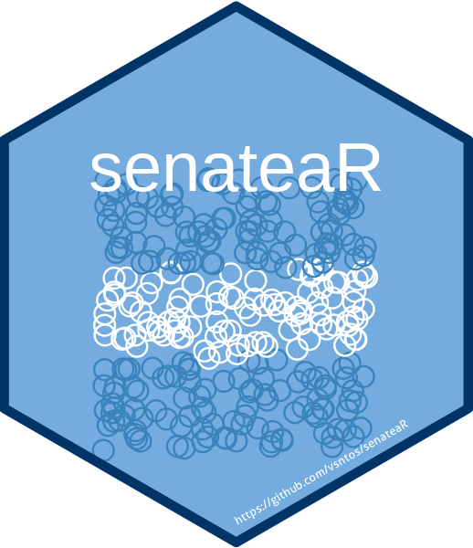

<!-- README.md is generated from README.Rmd. Please edit that file -->

# senateaR 

<!-- badges: start -->

[](https://github.com/vsntos/senateaR/actions/workflows/R-CMD-check.yaml)
<!-- badges: end -->

## Overview

senateaR provides functions to fetch and parse open data published by
the Argentine Senate (“Senado de la Nacion Argentina”), including
current and historical senators, voting records and vote details,
commissions, session bulletins, procurement notices (“licitaciones”),
parliamentary entries (“asuntos entrados”), and stenographic
transcripts. Data are retrieved directly from the Senate’s public
open-data portal and website.

senateaR is the first package in a planned ecosystem of country-specific
legislative open-data packages. Each package targets a single country
and exposes an English-language, consistently named API (`get_*()`
functions returning tibbles), so that data from different legislatures
can be combined and compared directly.

## Installation

senateaR is not yet on CRAN. Install the development version from
GitHub:

``` r
# install.packages("devtools")
devtools::install_github("vsntos/senateaR")
```

## Usage

``` r
library(senateaR)

# Current senators
senators <- get_senators()
head(senators)

# Historical senators
senators_hist <- get_senators_historical()
head(senators_hist)

# Senate commissions
commissions <- get_commissions()
head(commissions)

# Voting records for one or more years
votes <- get_senate_votes(c("2023", "2024"))
head(votes)
```

## Functions

| Function | Description |
|----|----|
| `get_senators()` | Current senators |
| `get_senators_historical()` | Historical senators |
| `get_senate_votes()` | Voting records by year |
| `get_vote_detail()` | Per-senator detail for a given vote |
| `get_commissions()` | Senate commissions |
| `get_bulletins()` | Session bulletins |
| `get_senate_procurements()` | Procurement notices (“licitaciones”) |
| `get_senate_parliamentary_entries()` | Parliamentary entries (“asuntos entrados”) |
| `get_senate_stenographic_versions()` | Stenographic session transcripts |

## Data source

All data are retrieved live from the official Argentine Senate open-data
portal and website (senado.gob.ar). Because these are third-party live
endpoints, results depend on the source’s availability and structure at
call time.

## License

MIT © Vinicius Santos
